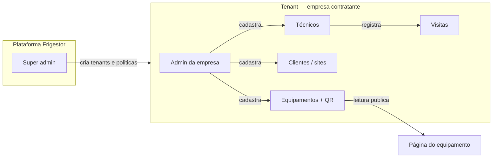

# Frigestor

Plataforma **SaaS multi-tenant** para empresas de **instalação, manutenção e contratos em refrigeração** (e operações similares com equipe em campo). Centraliza cadastro de clientes, equipamentos, técnicos, visitas e **QR Code** por ativo — com painel administrativo por empresa e visão operacional para técnicos.

Site de referência (produção): [frigestor.vercel.app](https://frigestor.vercel.app/)

---

## O que é

O Frigestor substitui planilhas e mensagens soltas por um **histórico único** de cada equipamento: quem instalou, onde está, especificações, visitas registradas e acesso rápido via QR na etiqueta do ativo. Cada **empresa contratante** opera em um **tenant** isolado (dados, usuários e marca própria).

Não é ERP nem emissor fiscal: foco em **rastreabilidade operacional** e **prova de serviço** para contratos de manutenção.

---

## Como funciona (visão geral)



1. **Super administrador** (operador da plataforma): cria empresas (tenants), aprova cadastros pendentes quando aplicável e gerencia a base global.
2. **Administrador da empresa** (tenant): cadastra **clientes** (obras, lojas, unidades), **técnicos**, **equipamentos** e consulta histórico e estatísticas.
3. **Técnico**: acessa visão de **campo** — equipamentos atribuídos, registro de visitas e leitura de QR.
4. **Público / cliente final**: pode abrir a ficha do equipamento via **QR Code** (dados permitidos na configuração do tenant).

Autenticação atual: **e-mail e senha** (sessão via API). Cadastro público e login Google podem ser desligados por variáveis de ambiente (`ENABLE_PUBLIC_SIGNUP`, `ENABLE_GOOGLE_OAUTH`). Ver `docs/OAUTH-REATIVAR.md`.

---

## Capacidades principais

| Área | Recursos |
|------|----------|
| **Multi-tenant** | Uma instância da plataforma; dados segregados por empresa no **Cloud Firestore**. |
| **Usuários** | Papéis: `super_admin`, `admin` (empresa), `tecnico`. Admin cria técnicos com acesso já liberado; e-mail de boas-vindas com login (e-mail) e senha definida no cadastro. |
| **Clientes** | Cadastro com endereço, CNPJ opcional, áreas e observações. |
| **Equipamentos** | Tipos (ex. ar condicionado), vínculo a cliente e técnico, specs, data de instalação, QR e página pública. |
| **Visitas** | Histórico por equipamento e visão consolidada no admin. |
| **E-mail transacional** | Boas-vindas (conta criada pelo admin), recuperação de senha (SMTP configurável). |
| **Deploy** | Site estático + API Node na Vercel; desenvolvimento local com `server.js`. |

Limites por plano (técnicos, equipamentos etc.) são definidos **comercialmente no contrato**; a aplicação pode evoluir para aplicar esses limites na API. Hoje o admin do tenant pode cadastrar técnicos conforme a política acordada.

---

## Stack e execução local

- **Frontend:** HTML, CSS e JavaScript (sem framework pesado).
- **Backend:** Node.js + Express (`server.js`, `api/index.js` na Vercel).
- **Dados:** Cloud Firestore (`lib/data-store.js`), projeto Firebase configurado via variáveis de ambiente.

```bash
npm install
npm run setup:firebase-env   # primeira vez: gera .env com credenciais Firebase
npm start
```

Configure `.env` (Firebase, SMTP, flags de auth). Não versione credenciais.

---

## Modelo comercial (resumo)

O Frigestor é oferecido como **licença de uso (SaaS)** em assinatura recorrente, opcionalmente com **serviço de implantação** (setup, importação de dados, treinamento).

### Formas de contrato previstas

1. **Contrato de licença de software (SaaS)** — objeto, prazo, plano, limites, suporte, LGPD, pagamento e rescisão.
2. **Contrato ou pedido de implantação** — escopo, entregáveis, prazos e valor único (setup).
3. **Proposta comercial** — plano recomendado, investimento ano 1 e condições (piloto, anual etc.).
4. **Anexo de planos** — limites de técnicos, equipamentos e SLA por tier.

Modelos editáveis (proposta, contratos e estudo de caso para o nicho de refrigeração) ficam em **`docs/contratos/`**, pasta **ignorada pelo Git** — uso interno e negociação; revisar com advogado antes de assinar.

### Preços

**A definir** por negociação, conforme porte do tenant (técnicos, equipamentos, escopo de implantação). Referência de mercado (CMMS / field service no Brasil e exterior) aponta faixas na ordem de:

- **Implantação:** tipicamente R$ 4.500 – R$ 12.000 (escopo fechado: tenant, carga inicial, QR, treinamento).
- **Assinatura mensal:** tipicamente R$ 600 – R$ 1.500+ para PME com equipe em campo, ou composição por técnico com mínimo mensal.

Tabela sugerida (Starter / Profissional / Enterprise), estudo de caso do nicho e textos de contrato estão nos arquivos locais em `docs/contratos/` (não versionados).

---

## Estrutura do repositório (resumida)

```
api/              # Entrada serverless (Vercel)
assets/           # CSS, JS, imagens
lib/              # E-mail, auth, Firestore
pages/            # Telas (login, admin tenant, campo, equipamento público)
docs/             # Documentação técnica (ex.: OAuth)
server.js         # Servidor de desenvolvimento
vercel.json       # Rotas estáticas + API
```

---

## Licença e contato

Código e produto sob responsabilidade do titular do repositório. Para contratação, suporte ou demonstração, utilize os canais definidos pelo operador da plataforma.

---

## Documentação adicional

| Documento | Conteúdo |
|-----------|----------|
| `docs/OAUTH-REATIVAR.md` | Reativar Google OAuth e cadastro público |
| `docs/contratos/` *(local, não versionado)* | Modelos de proposta, licença SaaS, implantação e estudo de caso |
